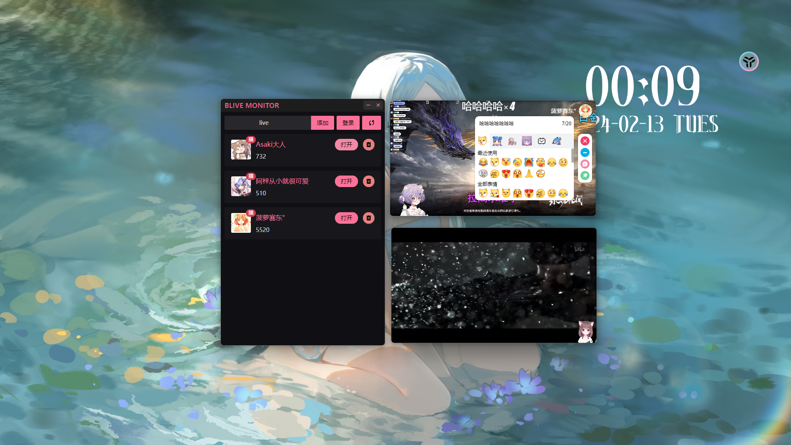

    <h1>Blive Monitor</h1>
    
更好的的B站直播观看器

     
    

## 功能

- 可以快速的打开一个精简的窗口浏览直播
- 支持发送弹幕
- 支持发送表情
- 支持多开

## 第三方开源组件

- [Vue.js](https://cn.vuejs.org)
- [Naive UI](https://www.naiveui.com/zh-CN/light)
- [UnoCSS](https://unocss.dev/)
- [bilibili-API-collect](https://github.com/SocialSisterYi/bilibili-API-collect)
- [electron-vite](https://github.com/alex8088/electron-vite)
